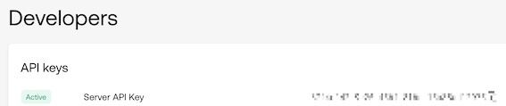
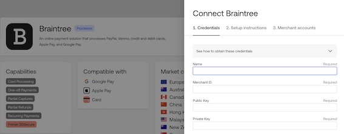
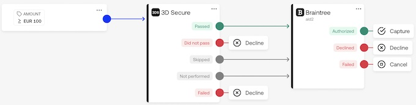

# Webshop app with Primer

Quick guide to setup your payment experience with [Primer](https://primer.io/) and start a local webshop app for displaying Primer Universal Checkout.

Requirements :
- Nodejs
- npm
- Express
- Webpack


## Get started

- Once you signed up and received your sandbox account, you can access to your [Primer sandbox dashboard](https://sandbox-dashboard.primer.io)

- Grab your api key required to interact with Primer api by going to [Developpers](https://sandbox-dashboard.primer.io/developers) page:



Now you are ready to start installation


## Installation

- Clone the repo and go to the created directory

```bash
git clone https://github.com/AlDal0/Primer-app.git
cd ./Primer
```

- Install the project dependencies with npm

```bash
npm i
```

- Create an `.env` file in the root directory of the project, copy the content of the `.env.example` and replace API_KEY and PORT with your values.


## Start the webshop app

- Run
```bash
npm start
```

- Open your web browser with http://localhost:PORT/
    

## Try Universal Checkout
    
- You can use following testing card numbers
```
4111 1111 1111 1111 : normal card
4000 0000 0000 1091 : card with 3DS authentication
```

## Define your workflows
    
- Now you have done your first successful test transactions you can play with Connections and Workflows components to define your payments processing strategy.

- Start by adding a processor in your [Connections](https://sandbox-dashboard.primer.io/connections) area :

[Connections doc](https://primer.io/docs/connections)



- Then you can design your optimization strategy in your [Workflows](https://sandbox-dashboard.primer.io/workflows) area :

[Workflows doc](https://primer.io/docs/workflows)




## Going further into the customization

- You can change the`client.js` file to add your own script for Universal Checkout component, just make sure to run the following to generate an updated  `builder.js` with webpack and restart the app
 
```bash
npx webpack && npm start
```
